# ABSTRACT
Nesta is a social media platform that enables user to share information, photos,add friends, message, share everyday moments, share thoughts and ideas and keep in touch with friends and family. Nesta is derived from Jamaican language which defines ‘messenger’. Nesta offers real time communication through internet or LAN. It allows user who sign-up to connect with friends, work colleagues, people and add or unfriend friends. Users can use search bar to find their friends and add them with the help of personal details like username, email and name. It allows user to share ideas through textor post, update profile and also visit friends profile. It allows users to comment on any post, but it does not allow users to add toxic comments. The primary purpose and objective of nesta is to provide people the power to build community and bring the world closer together in friendly environment. Nesta supports MD5 hashing algorithm to store password safely. All the message sent and received are encrypted in secure communication utilizing end to end encryption implementing RSA-4096 Asymmetric key Encryption for privacy. Through Nesta users can send even images also. Users can add story and also update newsfeed which can add comments likes and also dislike the post. In conclusion nesta aims to connect with the people around/far from them, share their ideas add/unfriend people and understand more of what's going on with the people around them and understand more in general.

_**Keywords**: social media platform, messenger, RSA-4096_ 

# ABBREVIATIONS

|      |                                   |
| ---- | --------------------------------- |
| BCA  | Bachelors in Computer Application |
| CSS  | Cascade Style Sheet               |
| HTML | Hyper Text Markup Language        |
| MD5  | Message Digest 5                  |
| PHP  | Hypertext Pre-Processor           |
| RSA  | Rivest-Shamir-Adleman             |


# CHAPTER 1
# INTRODUCTION
## 1.1. Introduction
Social media is digital technology that allows the sharing of ideas and information, including text and visuals, through virtual networks and communities. Social media typically features user-generated content that lends itself to engagement via likes, shares, comments, and discussion. There are many different types of social media platforms, each with its own unique features. Some of the most popular platforms include Facebook, Twitter, Instagram, and YouTube. These platforms allow users to create profiles, share photos and videos, and send messages to each other. They can also be used to follow news and events, and to connect with friends and family. Social media platforms have had a significant impact on the way of communication and share information. They have made it possible for people to connect with each other more easily than ever before, and they have given us a platform to share our thoughts and ideas with the world. 

Therefore, our project is all about connecting with people through message. Our project is an example of a Social Media Platform. The way user communicate through internet from messenger can transfer message text, image in real time. 

Nesta is derived from Jamaican language which defines ‘messenger’. Nesta offers real time communication with text and image with friend through internet or LAN. Nesta is mainly focused for messaging with sending and receiving freind request with one another with visiting other profile.

## 1.2. Problem Statement
Some social media platforms are plagued by a multitude of issues that hinder their overall effectiveness and user experience. The prevalence of spam bot accounts creates an atmosphere of annoyance and disrupts genuine interactions. The incessant barrage of advertisements disrupts the flow of content and can be perceived as intrusive and irritating. The lack of encryption on many messenger platforms raises serious privacy concerns, leaving users' sensitive communications vulnerable to interception.

## 1.3. Objective
The main objective of Social Media platform are:
1. To avoid toxic conversation between users.
2. To engage in secure communication utilizing end-to-end encryption.

## 1.4. Scope and Limitation
Every Social Media have its own unique features and its limitations. This messenger offers following scope and limitation:

#### 1.4.1 Scope
• Send messaging: This Social Media Platform allows users to send and receive text messages as well as image with friends.
• View profile: This Social Media Platform allows to visit friend profile.
• Image uploading: This Social Media Platform allows user to upload image in newsfeed as well as in story.
• Add/send friend: This Social Media Platform allows to send and add friend request.

#### 1.4.2 Limitation
• Image size limits: This Social Media Platform has a limit of uploading image of 4MB.
• User Experience: This Social Media Platform lacks user experience.

## 1.5. Report Organization
Report organizing for each chapter that has been documentation is refers to specific format and it is easy to understand by the readers for the whole of the report.
#### Chapter 1: Introduction
It provides an overview of the project's significance, problem statement, objectives, scope, limitations, and development methodology.
#### Chapter 2: Background Study and Literature Review
It covers foundational knowledge and a review of related projects and research. It includes the study of the current trends, preferences of people, the existing systems.
#### Chapter 3: System Analysis and Design
It discussed about the System analysis, Requirement analysis (Functional and Non-Functional), Feasibility analysis (Economical, Technical, Operational, Schedule) and Data Modeling, process Modeling, System design(Architectural Design, Database schema Design, Physical DFD) that has been used during the development of the system and system design.
#### Chapter 4: Implementation and Testing
It details the tools used, module implementations, and testing procedures.
#### Chapter 5: Conclusion and Future Recommendations
It consists of conclusion on the project development and future Recommendation.

# CHAPTER 2
# BACKGROUND STUDY AND LITERATURE REVIEW
## 2.1 Background Study
Social media platforms have become an integral part of modern communication and interaction. Social media platforms have undergone a remarkable transformation since their inception, evolving from rudimentary message boards into intricate tools that connect billions of people worldwide. Today, these platforms play a pivotal role in shaping our lives, facilitating information sharing, and fostering global interactions. 

The roots of social media can be traced back to the 1980s with the emergence of bulletin board systems (BBS). These early online communities provided a space for users to post messages, exchange ideas, and engage in discussions, laying the groundwork for the interactive and interconnected social media landscape that people know today. 
The late 1990s and early 2000s marked a significant turning point in the evolution of social media, with the rise of platforms like Six Degrees, MySpace, and Friendster. These platforms shifted the focus from purely online communication to fostering social connections and content sharing. Users could create profiles, share photos and videos, and connect with friends and family, paving the way for a more personalized and engaging social media experience. 
A pivotal moment arrived with the advent of Web 2.0 in the mid-2000s, which introduced user-generated content and social networking APIs. This technological leap empowered individuals to become active participants in shaping the online landscape, creating and sharing their own content, and connecting with others on a broader scale. The rise of giants like Facebook, Twitter, and YouTube further revolutionized social media, transforming communication patterns and fostering global connectivity. 

Today, social media platforms have become indispensable tools for communication, information sharing, and social interaction. They have permeated nearly every aspect of our lives, from personal connections to business operations, news consumption, and entertainment. These platforms have transformed how people connect with friends and family, access information, and engage with the world around us. 

However, the rapid evolution of social media has also brought about challenges and concerns. The spread of misinformation, the potential for cyberbullying and harassment, and the addictive nature of social media platforms are just a few of the issues that need to be addressed. As social media continues to evolve, it is crucial to find ways to harness its power for good while mitigating its potential negative impacts. The future of social media remains uncertain, but it is clear that these platforms will continue to play a significant role in our lives. As technology advances and new platforms emerge, social media will undoubtedly adapt to meet the changing needs and preferences of users. The key lies in ensuring that social media remains a force for positive connection, informed engagement, and responsible use.

## 2.2 Literature Review
Facebook, with over 2.9 billion active users, is a prominent social media platform that has a significant impact on society. While its features enable users to connect with friends and family, build social capital, and gain knowledge, it also raises concerns about social comparison, cyberbullying, and privacy. The platform's privacy policies, in particular, have drawn criticism. Further research is essential to fully comprehend Facebook's societal impact[1].

WhatsApp is a popular messaging application with over 2 billion users worldwide. It is known for its ease of use, affordability, and ability to connect people across geographical distances. The app's simple and intuitive interface makes it accessible to a wide range of users, while its free voice and text messaging capabilities eliminate the need for expensive phone calls or SMS charges. WhatsApp's global reach enables users to connect with friends, family, and colleagues regardless of their location, and its cross-platform compatibility allows seamless communication across various devices. Additionally, WhatsApp facilitates the creation of closed groups for private conversations, and supports the sharing of various multimedia content, including photos, videos, documents, and voice messages. These features have contributed to WhatsApp's immense popularity and widespread adoption[2].

# CHAPTER 3
# SYSTEM ANALYSIS AND DESIGN
## 3.1 System Analysis
System analysis of Social Media is a process of studying the software application to understand its components, interactions, and how they work together to achieve the application's goals. This analysis can be used to improve the application's performance, reliability, and security.

The system analysis of Nesta can be divided into two main phases: functional analysis and structural analysis. Functional analysis focuses on understanding the application' features and how they are used by users. Structural analysis focuses on understanding the application's components and how they interact with each other.

The results of the system analysis can be used to improve the application in a number of ways, such as improving performance, reliability, and security. The system analysis of Messenger is a valuable tool for improving the application's quality and performance.

### 3.1.1 Requirement Analysis
Requirement Analysis for messenger involves the send and receive message as well as image between users.
#### i. Functional Requirements
• Sending and receiving message: User can send and receive text between users.
• Upload image: User also can upload image in newsfeed.
• Friend request: User can send and receive friend request with one another.
#### Use Case Diagram 
Users can Register and Login in Social Media Platform Nesta. User can Add friend, Accept and Unfriend the request. User can upload Newsfeed with Comment and Like/Dislike. User can add Story and send Message to friend.

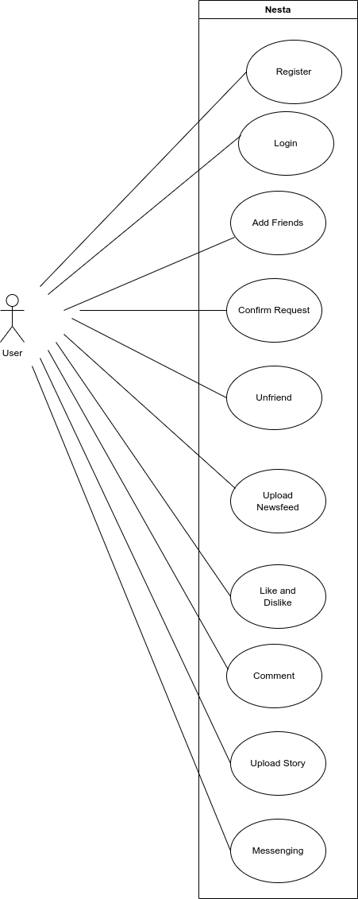
_Figure 3.1: Use case Diagram of Social Media Platform_

#### ii. Non-functional Requirements
• Scalability: This Social Media Platform can handle multiple users simultaneously.
• Security: This Social media platform stores password in MD5 hashing to prevent from security leak.
• Privacy: This Social Media platform supports end to end encryption that stores messages in RSA-4096 Asymmetric encryption.

### 3.1.2 Feasibility Analysis
#### i. Technical Feasibility
This project uses existing web technologies and tools so there is no difficulty in developing this project. Team members are also well-skilled to work on this nature of the project.
#### ii. Operational Feasibility
The project is very user-friendly and can be easily adapted by any new user that will use this website. As it uses well-known web technologies, it is easy to maintain.
#### iii. Economic Feasibility
This project is very cost-friendly as it uses existing free technologies. There is no cost for the tools that are being used.
#### iv. Schedule

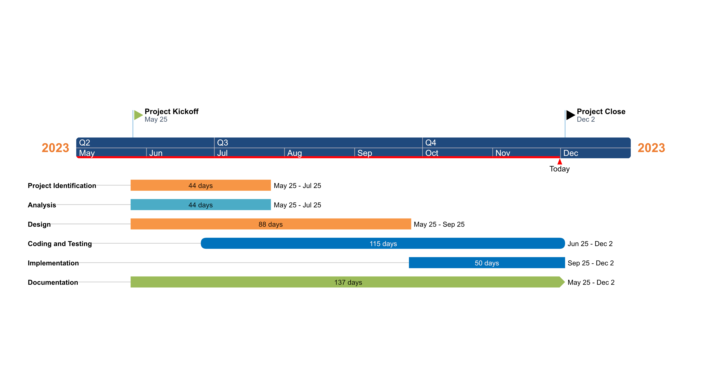
_Figure 3.2: Gantt Chart for Social Media Platform_

This is Gantt Chart on how the project were built. From May 25 to June 25, project identification were done. As analysis were simultaneously analysis with identification of program. Since spiral methodology were practised, Design were done from the beginning of project. Coding and Testing were performed from june 25. Implementation of the system were implemented from september 25. Documentation were built from first day.

### 3.1.3 Data Modelling (ER-Diagram)

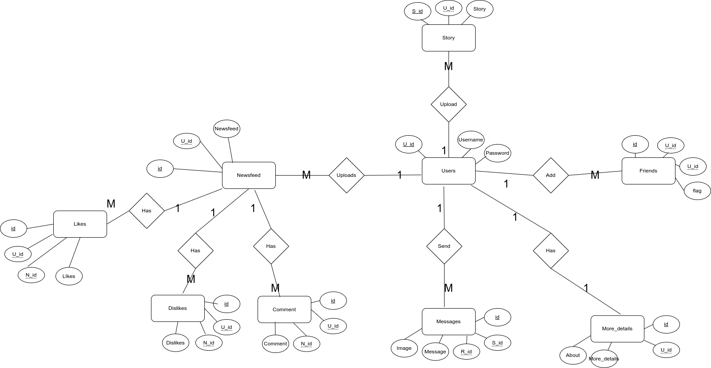
_Figure 3.3: Data Modelling (ER-Diagram) of Social Media Platform_

This is figure of ER diagram in which show the relation between entities. A user is identified by user id, Name(username), Password, etc. The user can sent multiple message which is identified by message ID, message, sender and receiver. A user can send friend request to friend which can be accepted. The User can upload newsfeed which can be liked and disliked with comments. The user can upload story which will disappear in next 24 hours.
### 3.1.4 Process Modelling (DFD)

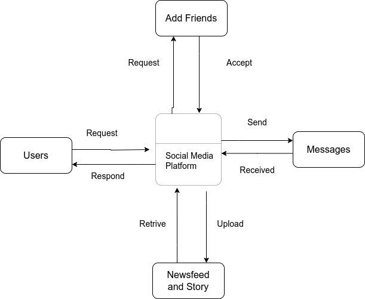
_Figure 3.4: Process Modelling (Level 0 DFD) of Social Media Platform_

9This is a DFD diagram how users send and receive messages. Users can add friends and Upload Newsfeed and Story.

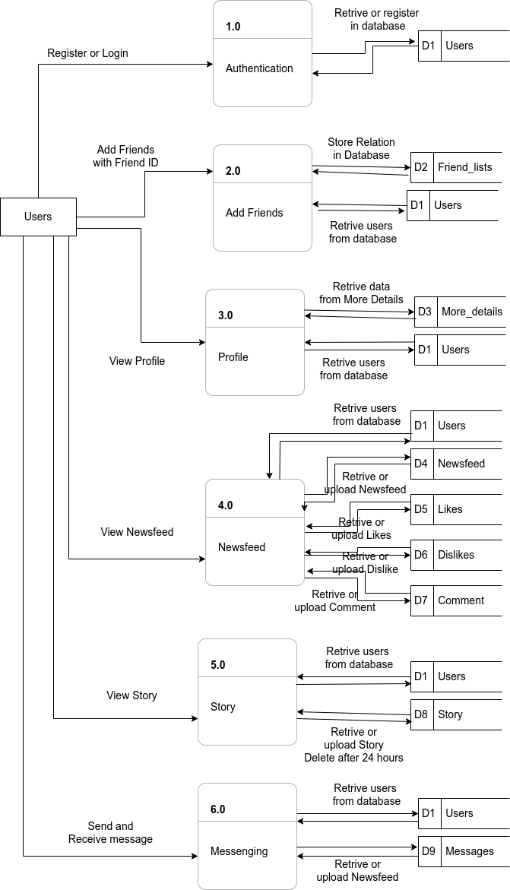
_Figure 3.5: Process Modelling (Level 1 DFD) of Social Media Platform_

10This is Level 1 DFD diagram that shows how data are flown, process and store. A user has to register in the beginning and is redirected to login. A database verifies the detail and redirect to his/her profile. A user has to send and receive friend request to/from friends. A user can send/receive message as well as retrive message which are encrypted
with RSA 4096 Asymmetric Encryption. A user can upload story which can disappear after next 24 hours and upload newsfeed which can be liked and disliked with comments.
## 3.2 System Design
### 3.2.1 Architecture Design

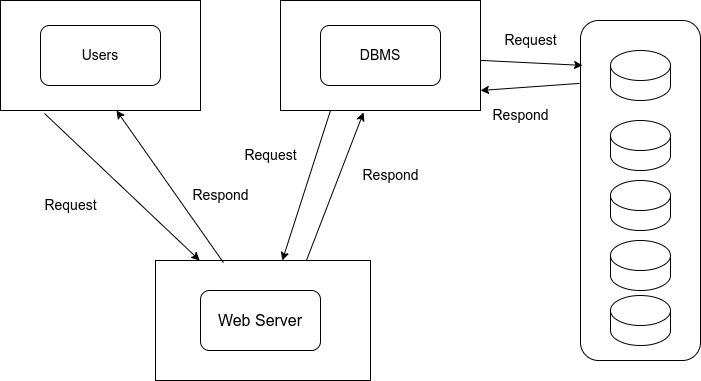
_Figure 3.6: Architecture Design of Social Media Platform_

In the Social media platform, Users interact with the system thriugh a sumple user interface. The shopping website uses three tier architecture. The data is collected from the users and stored in database through which server provides required data for users.

### 3.2.2 Database Schema Design
This is the Database Schema Design of Nesta in which user table contains id, username, password, firstname, middlename, lastname, dob, address, phone, email, registration, year and profile. The message table contains attribute of id, time, sender, receiver, sendreceive, message, image. At last friend_request contains attribute of friend1_id, friend2_id,  request_1 and request_2 to store friend request. A newsfeed has nid primary key with user_id foreign key, newsfeed and image. Likes, Dislikes and comment has similar attribute with primary key, foreign key userid and newsfeed_id with flag and comments.

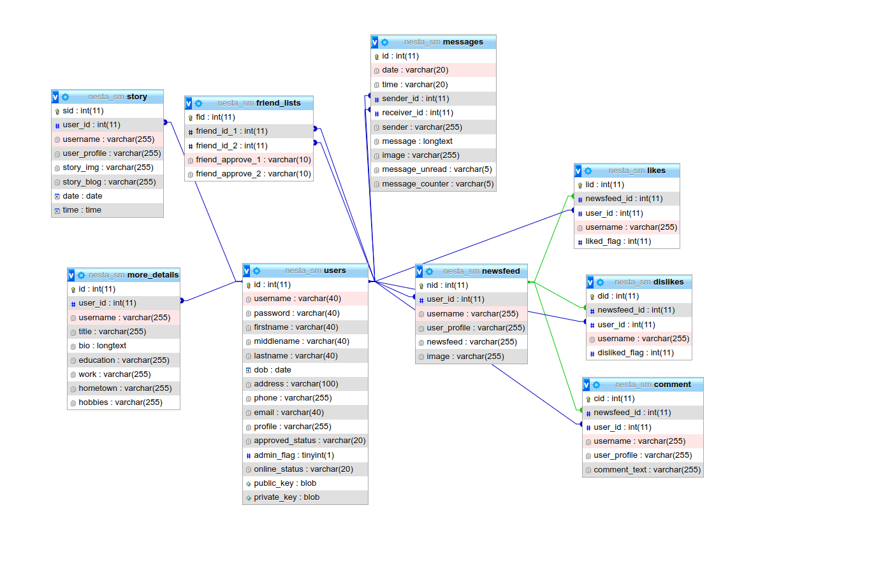
_Figure 3.7: Database Schema Design of Social Media Platform_

### 3.2.3 Interface Design (UI Interface / Interface Structure Diagram)

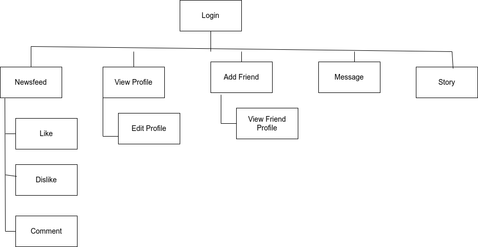
_Figure 3.8: Interface Structure Design of Social Media Platform_

Before implementing actual design, an Interface Design are constructed to visualize User interaction with system as they browse Registration, Login and redirect to Home. The interface design will closely follow our Functional Decomposition Diagram shown above.


# CHAPTER 4
# IMPLEMENTATION AND TESTING
## 4.1 Implementation
Implementation basically means the phase where the system is actually being built. First, all the information that gathered is studied and analyzed and implemented a system in operation for users. Implementation usually consists of coding, testing, installation, documentation, training and support.

### 4.1.1 Tools Used
#### Tools
#### • VS code
Vs code is used for writing code for the project. It is used for the coding HTML, CSS, Javascript and PHP.
#### • Apache Web Server
Apache web server is used to host the php file.
#### • Browser
Browser like firefox is used to run the project.
#### Programming Language
#### • HTML
HTML language is used in our project to run the backbone of the social media platform. It is used to display in browser.
#### • CSS
CSS is used to design the social media platform. It helps to design the format, color etc.
#### • Javascript
Javascript is used in our project to call the function, action in button, add event in project.
#### • Php
Php is used to run the backend of the program. It is used to optimise the code, connect database with code etc.
#### Database platform
#### • MySQLDatabase
Mysql database is used to store data, retrive and display data request by user.

### 4.1.2 Implementation Details of Modules
The proposed system is composed of different modules such as login module, messenging module, newsfeed module, etc. Implementation applicatin of this scale requires lot of resource and explaining the whole implantation process will not be clarified. So some of the modules are listed below.
#### • Login Module
The database verifies the login credentials and redirect to home page.

```php
$loginQuery = $mysql->prepare("select * from users where username=? and password=? and approved_status='1'");
$loginQuery->bind_param("ss", $username, $md5password);
$loginQuery->execute();
$loginQuery->store_result();

if($loginQuery->num_rows > 0){
    session_start();
    $_SESSION["username"] = $_POST["username"];

    $updateOnline = $mysql->prepare("update users set online_status = '1' where username = ?");
    $updateOnline->bind_param("s", $username);
    $updateOnline->execute();

    
    header("Location: ./index.php");
}
```

#### • Register Module
All the data entered in the form are stored in database for login verification process. Before registering the value, username, email, phone number are checked in database to prevent duplicate entry in database. If not found, data are registered in database as well as RSA 4096 key are generated in this module for sending and receiving encrypted text message each for different users.

```php
if(isset($_POST['register'])){
    if (isset($_FILES['profile']['error']) && $_FILES['profile']['error']== 0 ) {
        if (isset($_FILES['profile']['size']) && $_FILES['profile']['size'] < 4000000) {
            $file_types = ['image/jpeg','image/png','image/jpg'];
            if (in_array($_FILES['profile']['type'], $file_types)) {
                //chmod('images', 0777);
                echo  $pname = uniqid() . '_' . $_FILES['profile']['name'];
                if (move_uploaded_file($_FILES['profile']['tmp_name'], 'profile/' .$pname )) {
                    // echo 'Success';
                    $profile_upload_flag = 1;
                } 
                else {
                echo 'Image upload failed';
                }
            } 
            else {
                $err['profile'] = 'Image type mismatch';
            }
        } 
        else {
            $err['profile'] = 'Image size exceed';
        }
    } 
    else {
        $err['profile'] = 'Please upload image';
    }

    if($profile_upload_flag != 1){
        echo "<script>alert('upload profile')</script>";
    }

    if($_SERVER["REQUEST_METHOD"]=="POST" && $profile_upload_flag == 1 && isset($_POST["username"]) && isset($_POST["password"]) && isset($_POST["name"]) && isset($_POST["dob"]) && isset($_POST["address"]) && isset($_POST["phone"]) && isset($_POST["email"])){
        $middlename = "";
        $name = explode(" ",$_POST["name"]);
        for($i=1; $i<(count($name)-1);$i++){
            $middlename = $middlename . $name[$i] . " ";
        }

        $flag = 0;

        $password = $_POST["password"];
        $md5password = md5($password);
        $approved_status = 0;
        $admin_flag = 0;
        $online_status = 0;

        // Dublicate Data
        $dublicate_query = $mysql->query("select * from users;");
        while($row = $dublicate_query->fetch_assoc()){
            $username = $row["username"];
            $phone = $row["phone"];
            $email = $row["email"];
            // $registration = $row["registration"];

            if($_POST["username"] == $username || $_POST["email"] == $email || $_POST["phone"] == $phone ){
                // echo "<script> alert 'duplicate error;' </script>";
                $flag += 1;
                // break;
            }
        }

        if(!preg_match("/(([A-Za-z0-9\_]+))/i", $_POST["username"]) ){
            echo "<script>alert('username is not validate')</script>";
            $regex_validate_error = 1;
        }

        if(!( strlen($_POST["password"]) < 8 )){
            echo "<script>alert('password is not validate')</script>";
            $regex_validate_error = 1;
        }
        
        if(!preg_match("/(([A-Z][a-z]+)\s)+([A-Z][a-z]+)/i", $_POST["name"]) ){
            echo "<script>alert('name is not validate')</script>";
            $regex_validate_error = 1;
        }

        if(!preg_match("/(([A-Za-z0-9\s]+))/i", $_POST["address"]) ){
            echo "<script>alert('address is not validate')</script>";
            $regex_validate_error = 1;
        }


        if(!preg_match("/98[0-9]{8}/i", $_POST["phone"]) ){
            echo "<script>alert('phone is not validate')</script>";
            $regex_validate_error = 1;
        }

        if(!preg_match("/([a-z|0-9]+@[a-z|0-9]+.[a-z|0-9]+)/i", $_POST["email"]) ){
            echo "<script>alert('email is not validate')</script>";
            $regex_validate_error = 1;
        }
        
        if($flag == 0 && $regex_validate_error != 1){

            // RSA 4096
            $config = array(
                "digest_alg" => 'sha512',
                    "private_key_bits" => 4096,
                "private_key_type" => OPENSSL_KEYTYPE_RSA
            );
            $keyPair = openssl_pkey_new($config);
            $privateKey = NULL;
            openssl_pkey_export($keyPair, $privateKey);
            // var_dump($privateKey);
            $keyDetails = openssl_pkey_get_details($keyPair);
            $publicKey = $keyDetails['key'];
            // var_dump($publicKey);
            
            // Register User detail
            $registerQuery = $mysql->prepare("insert into users(username, password, firstname, middlename, lastname, dob, address, phone, email, profile, approved_status, admin_flag, online_status, public_key, private_key)values (?,?,?,?,?,?,?,?,?,?,?,?,?,?,?);");
        
            $registerQuery->bind_param("sssssssssssssss",$_POST["username"],$md5password,$name[0],$middlename,$name[count($name)-1],$_POST["dob"],$_POST["address"],$_POST["phone"],$_POST["email"],$pname,$approved_status, $admin_flag, $online_status,$publicKey,$privateKey);
            
            $registerQuery->execute();

            $registerd_username = $_POST["username"];
            // Insert More Details
            $get_user_id = $mysql->query("select * from users where username = '$registerd_username';");
            while($row = $get_user_id->fetch_assoc()){
                $user_id = $row["id"];
                $about_me = "About Me";
                $empty = "NULL ";
            }
            $register_more_details = $mysql->prepare("insert into more_details(user_id, username, title, bio, education, work, hometown, hobbies)values (?,?,?,?,?,?,?,?);");
        
            $register_more_details->bind_param("ssssssss",$user_id,$_POST["username"],$about_me,$empty,$empty,$empty,$empty,$empty);
            
            $register_more_details->execute();
            
            header("location: login.php");
        }

        else{
            echo "<script>alert('Dublicate data failed');</script>";
        }        
    }
    else{
        echo "<script>alert('register failed');</script>";
    }
}
```

#### • Friend Request Module
This module stores the data of two users id with the friend relation flags value. The two flags value helps to clarify the friends of the users. When a user send request to another user, user id of user 1 and user 2 is uploaded in friendlist table with friend_approve_1 and friend_approve_2 value 1 and 0 respectively. This confirms the sender of friend request to next users.

```php
if(isset($_POST["btn-add"]) == "Add Friend"){
    // echo "<script> alert('lol'); </script>";
    $query_add_friend_request = $mysql->prepare("insert into friend_lists (friend_id_1 , friend_id_2, friend_approve_1, friend_approve_2) values (?,?,?,?);");
			
    $query_add_friend_request->bind_param("iiii", $sess_uid, $_POST["add_friend_value"], $flag_value_1, $flag_value_0);
    
    $query_add_friend_request->execute();
}

```

#### • Accept Friend Request Module
As user get request from another user, second user has to set friend_approve_2 value 1 to accept friend request. When user accept request, friends are displayed in friendlist.

```php
if(isset($_POST["btn-accept"]) == "Accept"){
    $query_accept_friend_request = $mysql->prepare("update friend_lists set friend_approve_2 = ? where friend_id_1 = ? and friend_id_2 = ?;");
			
    $query_accept_friend_request->bind_param("iii", $flag_value_1, $_POST["friend_request_value"], $sess_uid);
    
    $query_accept_friend_request->execute();
}
```

#### • Friend List Module
Friend List module shows the list of friend of user. When user accept the request as friend_approve_1 and friend_approve_2 value 1 and 1 respectively, user can sent message to another user.

```php
$query_friend_list = $mysql->query("select * from friend_lists where (friend_id_1 = $sess_uid or friend_id_2 = $sess_uid) and (friend_approve_1 = 1 and friend_approve_2 = 1);");
while($row = $query_friend_list->fetch_assoc()){
    $friend_id_1 = $row["friend_id_1"];
    $friend_id_2 = $row["friend_id_2"];
    $approve_friend_1 = $row["approve_friend_1"];
    $approve_friend_2 = $row["approve_friend_2"];

    
    
    if($sess_uid == $friend_id_1){
        // echo $friend_id_2;
        
        $query_query_friend_list = $mysql->query("select * from users where (approved_status = 1 and id = $friend_id_2) $search_option_query;");
        while($row = $query_query_friend_list->fetch_assoc()){
            echo "<form method='post'>";
            $friendchat_uid = $row["id"];
            $friendchat_uname = $row["username"];
            $friendchat_profile = $row["profile"];
            $friendchat_online_status = $row["online_status"];

            if($friendchat_online_status == "1"){
                $friend_style_online = "style='border-radius: 50%; border: green 4px solid;'";
            }
            else{
                $friend_style_online = "style='border-radius: 50%; border: red 4px solid;'";
            }
            echo "<a href='profile.php?friend_id=".$friendchat_uid."'></a>";
            echo "<a href='profile.php?friend_id=".$friendchat_uid."'>".$friendchat_uname. "</a>";
            echo '<input type="hidden" name="friend_list_value" value="'.$friendchat_uid.'" >';
            echo "<input type='submit' name='btn-unfriend1' value='Unfriend' ><br><br>";
            array_push($array_push_id, $friendchat_uid);
            echo "</form>";
        }
        
    }

    if($sess_uid == $friend_id_2){
        // echo $friend_id_1;
        
        $query_query_friend_list = $mysql->query("select * from users where (approved_status = 1 and id = $friend_id_1) $search_option_query;");
        while($row = $query_query_friend_list->fetch_assoc()){
            echo "<form method='post'>";

            $friendchat_uid = $row["id"];
            $friendchat_uname = $row["username"];
            $friendchat_profile = $row["profile"];
            $friendchat_online_status = $row["online_status"];

            if($friendchat_online_status == "1"){
                $friend_style_online = "style='border-radius: 50%; border: green 4px solid;'";
            }
            else{
                $friend_style_online = "style='border-radius: 50%; border: red 4px solid;'";
            }

            echo "<a href='profile.php?friend_id=".$friendchat_uid."'></a>";
            echo "<a href='profile.php?friend_id=".$friendchat_uid."'>".$friendchat_uname. "</a>";
            echo '<input type="hidden" name="friend_list_value" value="'.$friendchat_uid.'" >';
            echo "<input type='submit' name='btn-unfriend2' value='Unfriend' ><br><br>";
            array_push($array_push_id, $friendchat_uid);

            echo "</form>";
        }
        
    }
}
```

#### • Unfriend Module
User can unfriend other user. When user pressed unfriend, the data of friend list is deleted of user id of user1 and user2 combined.

```php
if(isset($_POST["btn-unfriend2"]) == "Unfriend"){
    $query_unfriend_friend_list = $mysql->prepare("delete from friend_lists where (friend_id_1 = ? and friend_id_2 = ?);");
			
    $query_unfriend_friend_list->bind_param("ii", $_POST["friend_list_value"], $sess_uid);
    
    $query_unfriend_friend_list->execute();
}
```

#### • Newsfeed Module
Newsfeeds are defined with primary key n_id, foreign key user_id that helps to clarify the uploader by user. The newsfeed has comment, likes and dislike defined by primary key id and foreign key newsfeed_id and user_id with content.

```php
if (isset($_POST["whats_your_mind_btn"]) && $_POST["whats_your_mind_btn"] == "upload") {
    // echo "<script> alert('lol');</script>";

    if (isset($_FILES['newsfeed_image']['error']) && $_FILES['newsfeed_image']['error'] == 0) {
        if (isset($_FILES['newsfeed_image']['size']) && $_FILES['newsfeed_image']['size'] < 4000000) {
            $file_types = ['image/jpeg', 'image/png', 'image/jpg'];
            if (in_array($_FILES['newsfeed_image']['type'], $file_types)) {
                //chmod('images', 0777);
                $pname = uniqid() . '_' . $_FILES['newsfeed_image']['name'];
                if (move_uploaded_file($_FILES['newsfeed_image']['tmp_name'], 'newsfeed/' . $pname)) {
                    echo 'Success';
                    $flag_image_newsfeed = 1;
                } else {
                    echo 'Image upload failed';
                }
            } else {
                echo 'Image type mismatch';
            }
        } else {
            echo 'Image size exceed';
        }
    } else {
        echo 'Please upload image';
    }

    if ($flag_image_newsfeed != 1) {
        $pname = 0;
    }

    $newsfeed_upload = $mysql->prepare("insert into newsfeed(user_id, username, user_profile, newsfeed, image)values (?,?,?,?,?);");

    $newsfeed_upload->bind_param("issss", $sess_uid, $sess_Username, $me_profile, $_POST["whats_your_mind"], $pname);

    $newsfeed_upload->execute();
}
```

#### • Story Module
User who uploads the story are stored until for next 24 hours. The story will be seen by users who have accepted the friend requests.

```php
$flag = 0;
if(isset($_POST['post_story'])){
    if (isset($_FILES['img_story']['error']) && $_FILES['img_story']['error']== 0 ) {
        if (isset($_FILES['img_story']['size']) && $_FILES['img_story']['size'] < 4000000) {
            $file_types = ['image/jpeg','image/png','image/jpg'];
            if (in_array($_FILES['img_story']['type'], $file_types)) {
                //chmod('images', 0777);
                echo  $pname = uniqid() . '_' . $_FILES['img_story']['name'];
                if (move_uploaded_file($_FILES['img_story']['tmp_name'], 'story/' .$pname )) {
                    // echo 'Success';
                    $flag = 1;
                } 
                else {
                    echo 'Image upload failed';
                }
            } 
            else {
                $err['img_story'] = 'Image type mismatch';
            }
        } 
        else {
            $err['img_story'] = 'Image size exceed';
        }
    } 
    else {
        $err['img_story'] = 'Please upload image';
    }

    if($flag == 1){
        date_default_timezone_set("Asia/Kathmandu");
        $date = date("Y-m-d");
        $time = date("H:i:s");
        $query_story = $mysql->prepare("insert into story(user_id, username, user_profile, story_img, date, time)values (?,?,?,?,?,?);");
        
        $query_story->bind_param("ssssss",$me_uid, $me_username, $me_profile, $pname,$date,$time);
        
        $query_story->execute();
        echo "<script>alert('story');</script>";
        header("location: index.php");

    }
}
```

#### • Message Module
The message are sent from users to users with sender id and receiving id with message content. The message are encrypted with public key and decrypted with private key that helps in privacy. As the message texts are compared with toxic word stored in text file with regex are matched, the text are shown with asterisk \'\*\'.

```php
if(isset($_POST["send"])){
    if (isset($_FILES['image']['error']) && $_FILES['image']['error']== 0 ) {
        if (isset($_FILES['image']['size']) && $_FILES['image']['size'] < 4000000) {
            $file_types = ['image/jpeg','image/png','image/jpg'];
            if (in_array($_FILES['image']['type'], $file_types)) {
                //chmod('images', 0777);
                    $pname = uniqid() . '_' . $_FILES['image']['name'];
                if (move_uploaded_file($_FILES['image']['tmp_name'], 'message/' .$pname )) {
                    echo 'Success';
                } 
                else {
                    echo 'Image upload failed';
                }
            } 
            else {
                $err['image'] = 'Image type mismatch';
            }
        } 
        else {
            $err['image'] = 'Image size exceed';
        }
    } 
    else {
        $err['image'] = 'Please upload image';
    }

    if($_SERVER["REQUEST_METHOD"]=="POST"){
        $message_flag = 1;

        // RSA Encrypted
        $text_message = $_POST["text"];
        $encoded_encrypted = "";
        if($text_message != ""){
            openssl_public_encrypt($text_message, $encrypted, $receiver_public_key);
            $encoded_encrypted = base64_encode($encrypted);
        }			
        
        $registerQuery = $mysql->prepare("insert into messages(date, time, sender_id, receiver_id, sender, message, image, message_unread, message_counter)values (?,?,?,?,?,?,?,?,?);");
        
        $registerQuery->bind_param("sssssssii",date("Y-m-d"), date("h:i:s a"),$sess_uid,$receiver_id,$sess_Username,$encoded_encrypted,$pname,$message_flag,$message_flag);
        
        $registerQuery->execute();
    }

}
```

#### • Message Encryption Module
Firstly, RSA-4096 Asymmetric keys are generated in registration of accounts that are stored in users table. The message text are encrypted by receiver public key and stored in message table. The encrypted text are decrypted by receiver private key which can be read by receiver.

```php
if($message1 != ""){
    if($messagesender == $sess_Username){
        $decoded_encrypted = base64_decode($message1);
        openssl_private_decrypt($decoded_encrypted, $decrypted_message, $receiver_private_key);
        $message1 = $decrypted_message;	
    }
    else{
        $decoded_encrypted = base64_decode($message1);
        openssl_private_decrypt($decoded_encrypted, $decrypted_message, $sender_private_key);
        $message1 = $decrypted_message;	
    }
}
```

## 4.2 Installation
### 4.2.1 Linux
First clone the repository of this site. Type `sudo apt install apache2 && mysql` in terminal. Copy the zip/folder to `/var/www/html/`. Type `chmod +777 -R /var && chown apache:apache -R /var`. Import the `nesta.sql` in mysql database.

### 4.2.2 Windows
First install the XAMPP application in Windows. Copy the folder in `C:\Xampp\htdocs\`. Import the `nesta.sql` in `phpmyadmin`.

## 4.3 Testing
Testing is done as unit testing in the project where data is manually tested.

### 4.3.1. Unit testing
Unit testing is done by manually testing by entering value given by user. The some module of tested in social media platform are Login module, Register module, Newsfeed module, Story module and Message module.

a. Registration Testing

|ID |Test Case| Test Data| Expected Outcome|
|--|--|--|--|
|U_REG_1 |User Entering Data| Username: user Password: password Name: User Name DOB: 2001/06/07 Address: Nepal Mobile: 98765432120 Email: user@gmail.com|Registration Success, Redirect to Login Form.|
|U_REG_2 |User Entering Repeated Data| Username: user Password: password Name: User Name DOB: 2001/06/07 Address: Nepal Mobile: 98765432120 Email: user@gmail.com |Prompt the Dublicate Data.|

_Table 4.1: Registration Testing of Social Media Platform_

b. Login Testing

|ID |Test Case| Test Data| Expected Outcome|
|--|--|--|--|
|U_LOG_1| User Entering Wrong Data|Username: user Password: user |Prompt Invalid Username orpassword|
|U_LOG_2| User Entering Correct Data |Username: user Password: password |Redirect to index.php |

_Table 4.2: Login Testing of Social Media Platform_

c. Newsfeed Page
|ID |Test Case| Test Data| Expected Outcome|
|--|--|--|--|
|U_NEF_1| User uploading Newsfeed|Image: image.png Newsfeed: Feeling bored|Newsfeed is uploaded|
|U_NEF_2| User uploading with toxic word|Image: lol.png Newsfeed: hey mula |Newsfeed is uploaded with newsfeed text “hey m***”|
|U_NEF_3 |User uploading with wrong extension|Image: test.pdf Newsfeed: lol|Newsfeed is not uploaded as the wrong extension|

_Table 4.3: Newsfeed Testing of Social Media Platform_

c. Story Page
|ID |Test Case| Test Data| Expected Outcome|
|--|--|--|--|
|U_STR_1 | User uploading Story| Image: image.png |Story is uploaded|
|U_STR_2 |User uploading with wrong extension|Image: lol.pdf |Story will not be uploaded|

_Table 4.4: Story Testing of Social Media Platform_

c. Message Page
|ID |Test Case| Test Data| Expected Outcome|
|--|--|--|--|
|U_MSG_1 |User send message| Image: image.png Message: Hi|Message is sent|
|U_MSG_2| User send message with toxic word|Image: lol.png Message: hey mula|Message is sent with message text “heym***”|
|U_MSG_3 |User uploading with wrong extension image in message|Image: test.pdf Message: lol|Message is not sent as the wrong extension|

_Table 4.5: Message Testing of Social Media Platform_

# CHAPTER 5
# CONCLUSION AND FUTURE RECOMMENDATION
## 5.1 Lesson Learnt /Outcome
The primary goal of this project was to create the social media platform where users can interact with each their friends. The important lesson learnt was management of time according to complexity of the system component i.e. know which components to prioritize.
• Learn how to do system analysis and feasibility study.
• Learnt to integrate the system UI with database.
• Learnt how to perform CRUD operation.
• Learnt how to manage databases tables.
• Learn how to add RSA-4096 Asymmetric Encryption in a system.

## 5.2 Conclusion
Overall Nesta is a Social Media Platform that allows user to communicate with other users in form of text and images. It can work on any form of variety of devices browser. Nesta also provides the add, receive friend request with each other. Message texts are stored in RSA-4096 encryption to protect privacy between users.

## 5.3 Future Recommendation
Here are some of the features that can be added to increase its usability, user experience and portability of this platform.
• Friendly user experience.
• Advertisement module.
• Video sharing platform.
• Video and voice calling feature.

# REFERENCES
[1] [Online]. Available: https://about.fb.com/company—info.

[2] [Online]. Available: https://blog.whatsapp.com.

[3] [Online]. Available: https://xuri.me/2015/08/01/rsa-encryption-decryption-on-php.html.

[4] Praveen Dongola, Software Requirements Specification For MESSENGER, studocu, 2021.

[5] [Online]. Available: https://www.scaler.com/topics/md5-in-php.

# Appendix

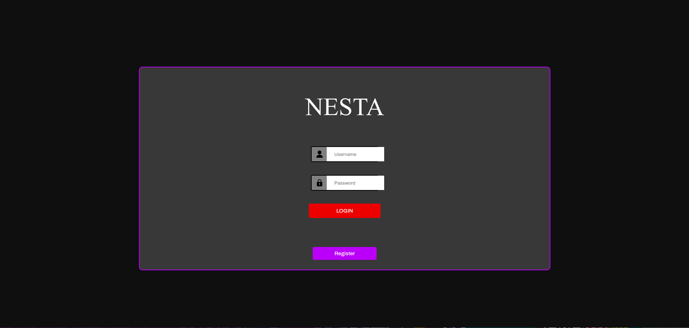
_Figure 3.9: Login Wireframe of Social Media Platform_

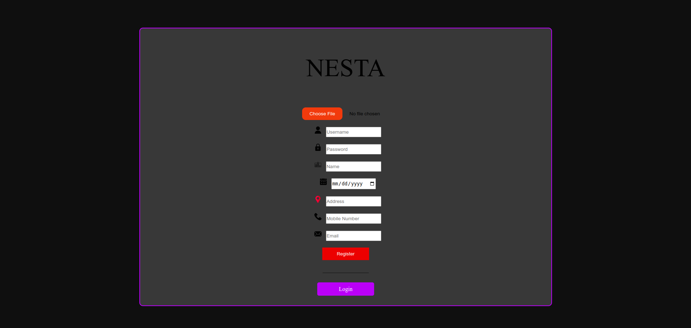
_Figure 3.10: Registration Wireframe of Social Media Platform_


_13Figure 3.11: Newsfeed Wireframe of Social Media Platform_

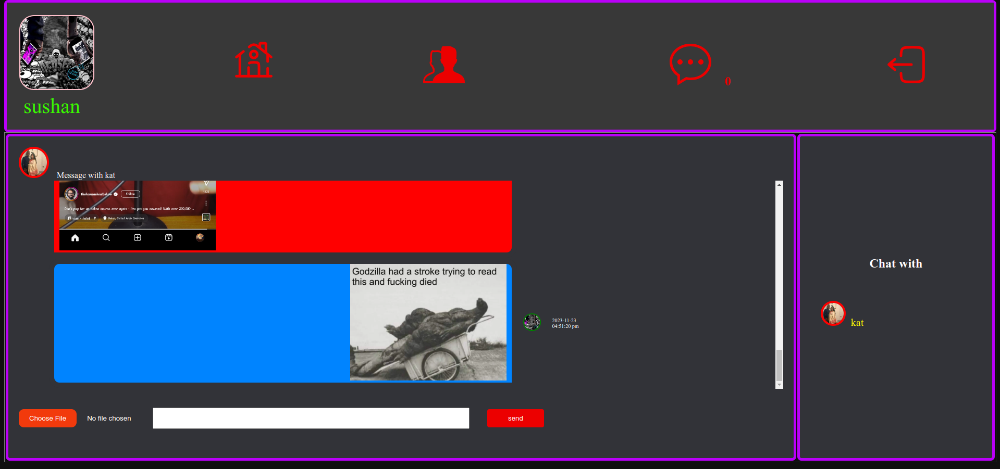
_Figure 3.12: Message Wireframe of Social Media Platform_

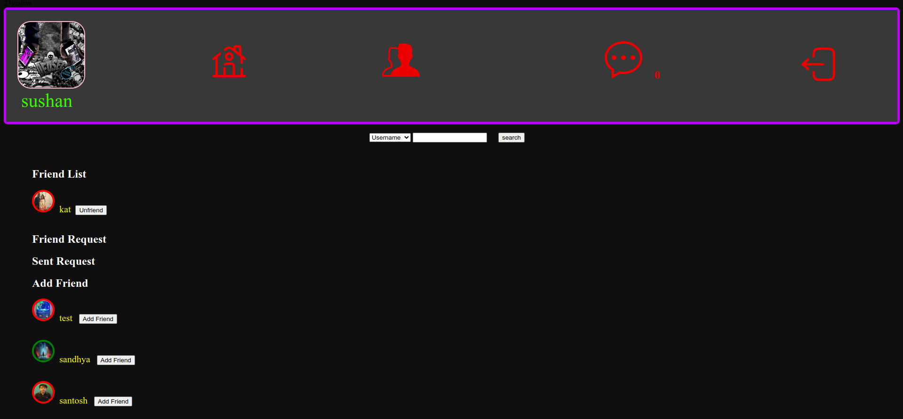
_14Figure 3.13: FriendLists Wireframe of Social Media Platform_

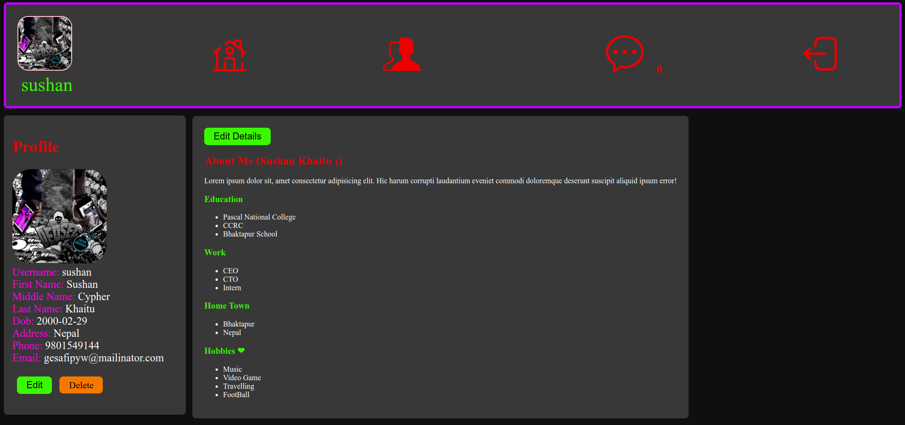
_Figure 3.14: profile Wireframe of Social Media Platform_